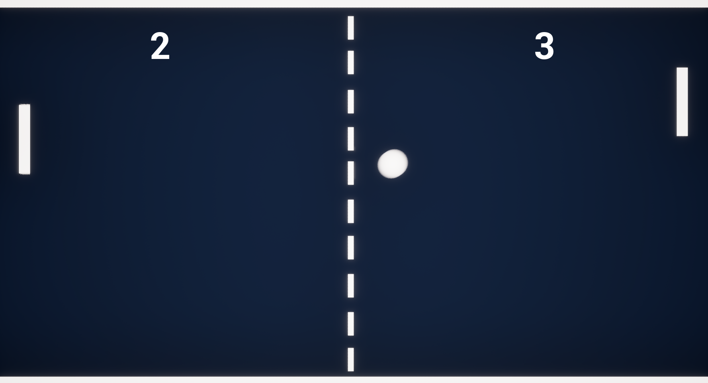

<h1 align="center">🏓 Pong Clone (Unreal Engine 5)</h1>

  A simple <b>Pong</b> clone recreated in <b>Unreal Engine 5</b>.  
  Play against a computer-controlled paddle and try to score as many points as possible!

---

<h2>🛠️ Technologies Used</h2>
<ul>
  <li><b>Unreal Engine 5</b> – Game engine</li>
  <li><b>Blueprints</b> – Gameplay logic</li>
</ul>

---

<h2>✨ Features</h2>
<ul>
  <li>🎮 <b>Classic Pong Gameplay</b> – Paddle vs paddle with a bouncing ball</li>
  <li>🤖 <b>Single-Player Mode</b> – Play against one AI opponent</li>
  <li>⚙️ <b>Fixed Difficulty</b> – AI has one set difficulty level</li>
  <li>📊 <b>Score Tracking</b> – Keeps track of both player and AI scores</li>
</ul>

---

<h2>🖼️ Screenshot</h2>

   
  <i>Gameplay preview</i>

